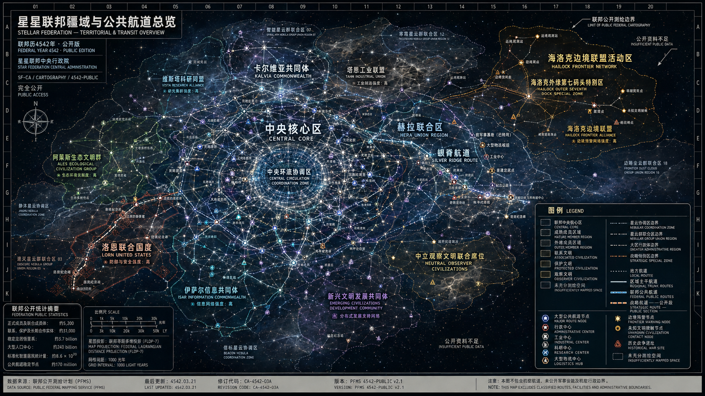

# 星星联邦

> 一个由星星文明建立并主导的跨星云联邦制超级文明：以高度成熟的工业体系、稳定的联邦制度与完整的科研体系为根基，P系列构成秩序的主体，S系列构成秩序的底线。联邦真正的核心从来不是某一种武器，而是文明持续发展的可能性。

## 世界速览

星星联邦（Stellar Federation）是已知宇宙中规模最大的联邦型文明之一，由星星文明建立并主导，通用称呼"星星文明"。联邦已知历史超过四千年，在超星团战争爆发前，已经形成运行了相当长时间的成熟联邦制度、跨星云经济网络、工业体系、科研体系与成员文明关系。约四千年前爆发的超星团战争（覆盖数万星系、多个文明集团）是这个既有文明体系遭遇的长期总体战争，而不是联邦秩序的起点。战争最终由联邦阵营取得胜利，胜利依赖原有的工业能力、科技积累、后勤体系与战略组织能力；战争本身则进一步推动了军事工业、战略平台和极端技术的研发。

联邦科技实行公开与机密双轨制。公开层级可商业化、可复制、可维护、可出口；机密层级严格保密、不参与市场流通、仅由中央机构掌握。已知火力体系存在明显代际划分：第四代体系（P系列）原理可理解、参数可观测、战略效果可预测，是联邦在战争前已经形成并长期发展的武装力量核心，战争使其获得大规模应用、扩产和代际升级；编号体系自P000至P999，另有未公开的更高编号层级（P1000以上由星星文明直接管理，S2参数曾提及P6000级主武器）。第五代体系（S系列）则是在战争压力与战争需求下诞生的特殊技术分支，信息高度封闭、作用机制未知、无法被完整复盘，属于联邦最高保密等级，战后被纳入更严格的封存与技术克制体系，定位是"最终保险机制"而非战争主力。

联邦采用多层级管理体系，最高政治结构由联邦中央议会、联邦执政委员会、星星文明中央代表团、联邦中央行政院、联邦最高法院与联邦监察总署构成。星星文明拥有联邦规模最大的工业、科研、中央行政、战略军团、公共航道与战略资源储备，拥有中央常任主导席位与特别否决权，在战略军团部署、P1000以上军事平台、最高机密科研等事项上具有主导权；但联邦并非星星文明单方面统治——星星文明控制中央核心，成员文明共同支撑联邦。主要成员与成员集团包括卡尔维亚共同体（商业）、洛恩联合国度（军事）、维斯塔科研同盟（科研）、阿莱斯生态文明群（生态）、塔恩工业联盟（工业）、伊萨尔信息共同体（信息）、海洛克边境联盟（边境防务）、新兴文明发展共同体与中立观察文明联合席位等。成员等级自创始主导文明至保护文明共六级。

联邦军事力量分四层：成员文明武装、区域联合防卫军、联邦中央军团（跨星云战争与超级文明冲突）与联邦战略军团（P1000以上系列、战略级航道系统、中央指挥平台与最高保密武器体系；S系列不属于常规战略军团编制）。联邦内部长期存在中央派、自治派与协调派三种政治立场，目前协调派通常占据政治主流。

围绕S系列存在长期伦理争论。联邦战略研究院公开报告认为未来存在三种可能发展方向：稳定维持（概率最高）、技术扩散（部分机密技术泄露导致局部军备升级）、秩序崩溃（极低概率）。当前世界处于战后稳定与技术克制时代：S2于约四十年前完成，长期处于实验室保存状态、未列装，被视为战争所催生的极端技术没有自动获得部署权的代表案例。

联邦日常社会并非由军事体系主导。成员文明保留本地货币、教育传统、社会制度与文化生活，联邦层面则以统一结算、公共航道、跨文明司法、资格互认和基础安全标准维持共同市场。高度发达的工业显著降低了基础物资成本，但航道容量、时间、稀有材料、特殊生态环境、专业服务与核心区位仍然构成真实稀缺。

## 正式设定

### 文明概述

**正式名称**：星星联邦（Stellar Federation）
**通用称呼**：星星文明
**性质**：跨星系联邦制超级文明
**成立时间**：不可考；联邦在超星团战争前已存在相当长时间，已知历史超过四千年。

**名称说明**：正式政治/制度语境中，"星星联邦"（或简称"联邦"）指整个政治共同体；成员文明语境中，"星星文明"指建立并主导联邦的创始核心文明本身（见"联邦组织架构·联邦性质"）。日常俗称中，外界允许将整个联邦广义称为"星星文明"，此为俗称，与成员文明专称并存。

**文明定位**：星星文明是已知宇宙中规模最大的联邦型文明之一。核心特征包括：

- 高度成熟的工业体系
- 完整的跨星系经济网络
- 发达的科学研究体系
- 稳定的联邦治理结构
- 长期运行的文明秩序维护机制

联邦对外奉行开放合作原则，鼓励贸易、科研交流与文明发展援助。大量成员文明与盟友文明通过联邦体系获得技术支持、资源保障以及安全保护。

**治理结构**：联邦采用多层级管理体系，正式最高政治结构为联邦中央议会、联邦执政委员会、星星文明中央代表团、联邦中央行政院、联邦最高法院与联邦监察总署（完整机构定义见"联邦组织架构"）；另设有联邦总战争委员会等专项机构。

联邦内部实行公开科研与机密科研双轨制度。公开科研成果可进入市场流通；涉及文明安全、宇宙稳定或战略级影响的技术则受到严格监管。

#### 联邦公开统计尺度

联邦中央统计体系为了让不同生理结构、寿命与社会制度的文明能够互相比较，使用大量“标准化统计口径”。这些数字是行政与经济意义上的折算值，不意味着所有居民都具有相同生活方式。

当前公开统计中常用的数量级包括：

| 项目 | 当前公开口径 |
| --- | --- |
| 具中央议会法定代表权的正式成员、联合成员体 | 约5,200个 |
| 联系文明、保护文明及长期观察合作实体 | 约31,000个 |
| 纳入长期人口、税务或公共服务统计的稳定定居恒星系 | 约37亿个 |
| 行星级、轨道级及深空大型人口中心 | 约2,400亿个 |
| 标准化智慧居民统计量 | 约8.6×10²⁰ |
| 联邦公共航道登记的长期稳定节点 | 约1.7亿个 |
| 中央与成员共同认可的高等教育/科研机构 | 超过1,200万所 |
| 联邦共同法长期有效的标准司法协作区 | 约8,600个 |

“标准化智慧居民统计量”是统计部门为预算、公共服务和代表权测算建立的折算指标。某些群体以单一个体计数，某些群体具有群体意识、分布式意识或周期性人格合并，因此原始生物学个体数量与该统计值并不完全相同。

这些数字也解释了联邦为何必须依赖分层治理。中央政府不可能直接管理数十亿个定居恒星系；绝大多数具体事务都在成员文明、地方行政区和区域协调机构内部完成，中央只维护共同法、结算、航道、跨文明争端与战略安全。

### 历史概览

#### 战争前的成熟发展阶段

在超星团战争爆发前，星星文明与成员文明已经经过漫长发展，逐步完成并稳定运行：

- 超光速航行体系建设
- 跨星系工业网络建设
- 大规模资源调配体系建设
- 标准化武器工业体系建设
- 联邦中央机构与成员自治关系
- 跨文明贸易、司法与公共航道制度
- 以P系列为代表的可观测、可维护军事技术体系

这一阶段持续时间已不可准确考证。联邦并非因战争临时拼合而成；战争开始时，它已经是一个制度成熟、成员关系稳定但内部存在权力分歧的超级文明。

#### 超星团战争（约四千年前）

约四千年前，已知宇宙爆发大规模超星团战争。战争覆盖范围：数万星系、多个文明集团、长期战略消耗体系。战争最终由联邦阵营取得胜利。

值得注意的是，战争胜利主要依赖于战争前已经形成的工业能力、科技积累、后勤体系与战略组织能力，而非单一终极武器。战争持续期间，长期消耗与敌方威胁推动联邦加速研发新型战略平台，其中包括后来被归入S系列的特殊技术。战争因此改变了联邦的技术边界，却没有创造联邦原有的制度与文明结构。

战争持续近三百年，期间的局部胜利始终无法直接转化为总体结束。航道纵深、工业储备、战略目标与双方的持续作战能力共同把战争推进为长期总体消耗；至于双方究竟为何无法通过普通外交达成长期共存，仍属于未完全公开的历史问题。

**联邦历法换算**：现行联邦历不是联邦建立年份，而是一次早期跨文明统一历法改革的纪元。当前约为**联邦历4542年**。超星团战争于联邦历238年爆发，战争第291年进入最终停火阶段，全面军事行动于联邦历529年前后终止，因此距今约四千年。按此换算，S1于联邦历523年左右完成建造，KX-441行动发生于联邦历526年左右；赫尔曼退休访谈记录于联邦历4260年，距今约282年；S2约于联邦历4502年前后完成。早于统一历法的历史继续使用旧纪年或相对年代，不强行换算。

#### 战后稳定与技术克制时代

战争结束后，联邦继续运行战争前已经存在的政治、经济与行政体系，并在修复战争损失的同时，对战争中诞生的极端技术进行重新管理。主要变化包括：

- 对S系列及同类极端技术实行严格封存
- 对高级武器进行更严格的受控扩散
- 重新划定战略军团、中央机构与成员文明的技术权限
- 维持战争前已有的文明间力量平衡，避免新的宇宙级军备竞赛
- 修复航道、工业网络、人口聚居区和成员政治关系

现今秩序体系因此具有两重来源：它的制度基础来自漫长的战前联邦历史，它对极端技术的克制原则则主要来自战争经验与S系列带来的冲击。

### 科技体系

#### 科研模式

联邦科技体系分为两个层级。

**公开层级**：特点为可商业化、可复制、可维护、可出口；主要服务于贸易、民生、联盟建设、军事合作。

**机密层级**：特点为严格保密、不参与市场流通、仅由中央机构掌握；主要目标为文明安全保障、极限科技研究、战略威慑建设。

#### 技术代际

已知联邦火力体系存在明显代际划分。

**第四代体系**——代表：P系列。特点：原理可理解、参数可观测、战略效果可预测。该体系的基础与主要制度在战争前已经形成，战争推动了它的扩产、升级、战场整合和战略化运用。

**第五代体系**——代表：S系列。它是在超星团战争期间，由长期战争需求与极端战略威胁推动形成的特殊体系。其特点是信息高度封闭、作用机制未知、无法被完整复盘；其技术原理至今未向外界公开。S系列的出现晚于联邦大部分制度与常规技术体系，但它的存在迫使战后联邦重新审视技术使用权。

### P系列战略平台

#### 基本概念

P系列是联邦最著名的工业化战略武器体系，特点包括：规模化生产、标准化维护、长期服役、可控扩散。P系列构成联邦武装力量的核心基础。

#### 编号体系

| 编号段 | 用途 | 代表型号 |
| --- | --- | --- |
| P000—P099 | 巡逻、护航、战术支援 | — |
| P100—P299 | 主力作战、区域控制 | — |
| P300—P599 | 星区压制、大规模舰队作战 | P300 |
| P600—P799 | 星系战争 | — |
| P800—P899 | 战略级部署 | — |
| P900—P999 | 指挥中心、移动堡垒、联邦枢纽 | P900 |

（注：公开编号体系止于P999，但联邦档案中另存在P1000以上与P6000级等未公开编号层级，见"出口原则""组织架构"相关章节、"S系列"与"当前空白"。）

#### 出口原则

联邦允许部分P系列装备进入国际市场，但受到严格限制：P1000以上型号不对外出售、核心技术保留、部分功能受联邦监管。其目的在于：促进稳定，而非制造失衡。

### S系列战略终端平台

#### 项目性质

S系列属于联邦最高保密等级项目，其定位并非战争主力，而是**最终保险机制**。

#### 基本特征

已知公开特征包括：第五代火力体系、极高技术密度、超远距离机动能力、隐蔽行动能力、信息不可复盘特性。其设计目标是：在最短时间内完成不可逆战略打击。

#### S1

**公开资料**：S1的研发与具体建造时间未公开。状态：封存。已知信息极少。多数历史学家认为：S1在实验阶段展现出了远超预期的战略影响力，最终未被正式列装。

**Ω级内部档案**：S1于战争第285年完成建造（见《附录档案：S1计划》），并于战争第288年KX-441行动中完成实战验证。公开与内部信息存在层级差：公开层面"研发时间未知"，内部档案则明确建造节点——两者并不矛盾，只是信息开放程度不同。

#### S2

完成时间：约四十年前。状态：实验室保存，未列装。

已知参数：

- 长度约1200米
- 战略效果在公开测试摘要中被标定为“接近P6000级主武器”
- 拥有超星系团级机动能力

其中“P6000级”属于联邦战略效果的等效标定语言，只表示在特定测试条件下可观测结果接近相应P系列战略武器，并不意味着S2安装了传统意义上的P6000级主炮，也不代表其作用机制与P系列相同。联邦从未公开其完整性能。

**S1停产与S2的关系**：S1首次实战后，S计划紧急科研会议提出"必须停止后续生产"——停止的是S1平台的继续复制、批量制造与当时规划中的即时后续生产，并不意味着永久终止所有S系列理论研究。战争结束后，S系列进入长期冻结、研究、伦理与制度审查阶段；数千年后，S2才作为新的单体实验项目获准完成。S2的完整研发史与立项决策过程未公开。

### 联邦战略哲学

**可控威慑**：联邦认为真正稳定的秩序应建立在可预测力量之上。因此P系列被设计为可观测、可统计、可理解的力量体系。

**不可见底线**：联邦同时保留极少量不可公开技术。其目的不是征服，而是确保任何试图摧毁现有秩序的行为都将面临最终制约。S系列被视为这一理念的体现。

**技术克制原则**：联邦长期坚持——技术能力不等于技术使用权。即使具备部署能力，也不意味着应当部署。S2长期未列装即被认为是这一原则的代表案例。

### 伦理争议

围绕S系列长期存在争论。支持者认为：它保障了宇宙秩序、避免了大规模战争、提高了战略稳定性。反对者认为：权力过度集中、缺乏外部监督、存在潜在滥用风险。相关争论至今仍在持续。

### 对外关系

联邦与绝大多数文明保持合作关系，主要手段包括：技术援助、军事合作、工业建设、贸易支持。但对于涉及极限技术的研究领域，联邦长期实行许可证制度，未经批准不得接触相关技术体系。

### 风险评估

联邦战略研究院公开报告认为，未来可能存在三种主要发展方向：

- **方案一：稳定维持**（概率最高）——现有秩序继续运行。
- **方案二：技术扩散**——部分机密技术泄露，导致局部军备升级。
- **方案三：秩序崩溃**（极低概率）——若联邦体系整体失效，战略终端技术可能被用于大规模政治或军事冲突，其后果难以评估。

### 联邦组织架构

> 本节核心内容来自《星星联邦组织架构白皮书》（文件编号 SF-GOV/WP-4281，发布机构：星星联邦中央行政院，公开等级：完全公开）。

#### 联邦性质

星星联邦是由星星文明建立并主导的跨星云文明联合体。联邦并非多个力量完全相等的文明临时结盟，也不是由星星文明直接吞并所有成员形成的单一帝国。其基本结构是：星星文明负责中央秩序、战略安全与制度维护；成员文明保留内部自治；联邦机构处理跨文明共同事务；联邦中央在战争、航道、战略科技与文明级危机中拥有最终协调权。

星星文明拥有联邦规模最大的：工业体系、科研体系、中央行政体系、战略军团、公共航道网络、战略资源储备。联邦中央机构的大多数基础设施、核心人员与长期预算均由星星文明提供。因此，星星文明既是联邦成员，也是联邦实际主导文明。

#### 主要成员文明名录

以下仅列出联邦公开确认的主要成员与成员集团，不包括全部区域成员、联系文明及保护文明。

**1. 星星文明**——联邦主导文明、创始文明
- 政治地位：中央常任主导席位
- 主要职责：维持联邦中央行政体系；管理核心战略军团；维护主要跨星云航道；承担中央科研体系；管理P1000以上军事平台；负责最高级别文明安全事务。
- 主要特点：星星文明是联邦工业、军事和科研实力最强的文明。联邦的大部分中央制度、共同法、军工标准与航道规范均由星星文明最初建立。其对外政策长期强调秩序、技术援助与受控扩散。

**2. 卡尔维亚共同体**——核心成员文明集团，性质为多文明商业共同体
- 主要贡献：跨星云贸易、金融结算、商业仲裁、大型运输网络、战略物流。
- 概况：由多个历史悠久的贸易文明组成，在联邦财政、贸易与公共运输领域具有较大影响力。由于其成员长期依赖跨区域市场而又拥有强烈地方传统，卡尔维亚政治文化通常同时支持统一市场与成员自治，对中央直接干预地方税制、商业法和航道定价尤其敏感。

**3. 洛恩联合国度**——核心军事成员，性质为多星云军事联盟
- 主要贡献：区域防卫、联邦边境驻军、战术军官培养、舰队标准化建设。
- 概况：拥有独立且成熟的军事工业体系，军队大量采用联邦P系列装备，但保留自身指挥传统。洛恩并不天然支持一切更强武器；其军方传统强调可验证的指挥链、责任归属与战场可控性，因此对脱离常规指挥体系的战略技术长期保持复杂甚至警惕的态度。

**4. 维斯塔科研同盟**——核心科研成员，性质为科研文明联合体
- 主要贡献：基础物理研究、天体工程、生物技术、人工智能安全、跨文明科研标准。
- 概况：长期参与联邦公共科研体系，但不拥有最高机密科研项目的独立控制权。维斯塔的科研文化尤其强调可重复验证、同行审查与风险分级；在联邦政治中，它既是新技术的重要推动者，也是“无法验证即不应直接部署”原则最稳定的支持来源之一。

**5. 阿莱斯生态文明群**——正式成员集团，性质为多生态文明联合体
- 主要贡献：行星生态修复、生物圈设计、大规模人口安置、战后环境重建。
- 概况：在战争后重建和灾害救援中具有重要地位。

**6. 塔恩工业联盟**——核心工业成员，性质为重工业文明联盟
- 主要贡献：大型舰体制造、战略材料加工、船坞建设、工业星云维护。
- 概况：是联邦军工供应链的重要组成部分，但生产体系必须遵守星星文明制定的中央军工标准。统一标准给塔恩带来巨大的市场与规模优势，也使其长期反对未经协商的中央生产指标、无补偿征用和标准无限扩张；它与中央的争议通常不是“要不要标准”，而是谁承担标准的成本。

**7. 伊萨尔信息共同体**——正式成员文明，性质为信息与计算文明集团
- 主要贡献：公共数据网络、远程通讯、战略计算、信息安全、跨文明语言与认知转换。
- 概况：在联邦信息基础设施中拥有较高地位，其核心系统受到中央安全机构共同监督。

**8. 海洛克边境联盟**——正式成员集团，性质为边境文明联合防卫体
- 主要贡献：外围航道巡逻、未知文明接触、边境预警、地方安全维护。
- 概况：经常承担联邦外围区域的第一线防务任务。

**9. 新兴文明发展共同体**——特殊成员集团，性质为大量新兴文明组成的联合代表机构
- 主要职责：代表低规模成员文明、协调发展援助、争取教育技术与贸易配额、防止大型文明垄断联邦资源。
- 概况：内部成员数量庞大，但单个成员的实力通常有限。

**10. 中立观察文明联合席位**——观察成员，性质为非正式成员文明联合席位
- 可参与：贸易、科研交流、灾害救援、部分安全会议。
- 无权参与：战略军团指挥、最高机密科研、联邦核心预算、P1000以上军事体系。
- 概况：不完全接受联邦中央法，但与联邦保持稳定合作。

#### 成员等级

联邦成员并非只有"成员"与"非成员"两种状态，主要分为以下层级：

- **一级：创始主导文明**——目前仅包括星星文明。拥有中央常任席位、战略安全主导权、最高军团管理权、中央制度维护权。
- **二级：核心成员文明**——包括卡尔维亚共同体、洛恩联合国度、维斯塔科研同盟、塔恩工业联盟等。拥有联邦高级议会席位、中央委员会常设代表、大型公共项目优先参与权、战时军团级联合指挥资格；但无权单独控制联邦战略军团。
- **三级：正式成员文明**——拥有完整成员权利，包括议会席位、联邦市场准入、公共防务保障、联邦法院保护、技术与教育合作。
- **四级：联合成员体**——由多个中小文明共同组成，以联合席位参与联邦事务。
- **五级：联系文明**——与联邦合作，但未接受全部成员义务。
- **六级：保护文明**——由联邦提供安全和发展援助，但尚不具备正式成员资格。

#### 联邦最高政治结构

联邦中央最高政治体系由以下机构构成：联邦中央议会、联邦执政委员会、星星文明中央代表团、联邦中央行政院、联邦最高法院、联邦监察总署。

**联邦中央议会**负责：制定联邦法律、批准预算、接纳新成员、审议重大条约、监督中央机构、批准全面战争状态。议会席位由三部分组成：成员基础席位（每个正式成员或联合成员体拥有最低代表权）、综合比例席位（依据人口、工业、财政贡献与公共责任分配）、中央常任席位（由星星文明及少数核心成员持有）。星星文明拥有最多席位，但法律上不能单独通过普通议案；涉及战略安全、中央军团和最高机密科研时，星星文明拥有特别否决权。

**联邦执政委员会**是联邦最高政治协调机构，常任成员包括：星星文明首席执政代表、核心成员文明代表、中央议会代表、中央行政院负责人、战略安全代表。星星文明首席执政代表通常担任委员会主席。委员会采取集体表决，但星星文明在以下事项上具有主导权：战略军团部署、P1000以上军事平台、最高机密科研、联邦中央安全、文明级紧急状态。

#### 星星文明中央代表团

星星文明中央代表团是星星文明参与联邦治理的最高政治机构。它并不等同于联邦政府，但在实际运行中承担了大量中央稳定责任。主要职责包括：提名联邦关键行政官员、维护中央军团、提供中央预算、管理中央工业基地、协调最高科研项目、在制度危机中维持联邦连续性。

其他成员经常批评星星文明权力过大；星星文明方面则认为，其承担的责任、成本和风险也远高于其他成员。这一矛盾是联邦长期政治争论的核心之一。

#### 中央行政体系

联邦中央行政院负责日常治理，主要部门包括：成员与外交事务部、财政与战略资源部、工业协调部、航道与交通部、科学技术部、公共安全部、文明发展部、信息传播署、军工贸易管理局。

其中，**信息传播署**是行政监管与公共信息基础设施机构，负责紧急广播标准、公共数据接口、媒体法执行、档案公开程序和跨文明传播安全；**联邦新闻署**则是依据公共章程设立的联邦级公共新闻机构，中央新闻台属于其主要广播网络之一。新闻署接受预算、审计和共同法监督，但其日常编辑决策原则上不由信息传播署直接下达。战争时期军方安全审查与新闻署编辑判断之间长期存在张力，这也是《晚间新闻结束以后》中大量删节程序的制度背景。

行政院负责人由执政委员会提名，并经中央议会确认。星星文明通常在工业、战略资源、科研与军工部门中拥有较强影响力；其他核心成员则在贸易、生态、信息和区域治理部门中占据较多职位。

#### 地方行政结构

联邦的地方治理不以单一星系为主要单位，而通常采用：星云协调区、星云群联合区、大区行政体、战略特别区。地方行政机构主要负责协调，不直接取代成员文明政府。

- **星云协调区**：负责一个或多个相邻星云的航道、贸易、安全、司法协调、公共设施。
- **星云群联合区**：由多个协调区组成，负责大型工业网络、区域防卫、人口迁移、跨星云基础设施。
- **战略特别区**：由中央直接管理，通常包括核心军工区、中央科研区、远古遗迹区、重要航道枢纽、战后接管区。

公开资料中常被用作行政教学案例的三个区域包括：

- **中央环流协调区**：位于联邦核心公共航道网络，登记稳定定居恒星系约190万个，人口统计量约7.4×10¹⁷。拥有高密度行政、科研、金融和教育机构，航道拥堵与核心区住房成本远高于联邦中位水平。
- **赫拉联合区**：由超星团战争时期的赫拉方向战区逐步重组而来，现有登记定居恒星系约42万个。银脊航道仍是区域经济骨架，许多军用前进基地在战后改造成工业、物流与纪念设施。当地政治长期关注战损补偿、军方土地使用和历史遗址保护。
- **海洛克外缘第七码头特别区**：典型边境战略特别区，常住人口统计量不足中央环流区的千分之一，却负责多条外围探测、救援与未知文明接触航线。其中央财政人均投入极高，是自治派经常质疑“战略安全预算不透明”、中央派则强调“边境不能按人口平均分配资源”的典型案例。

这些实例说明，联邦地方行政单位的政治重要性不能只看人口：一个人口稀少的航道节点或边境特别区，可能拥有比大型人口中心更高的战略预算。

#### 军事体系

联邦军事力量分为四层：

1. **成员文明武装**——各成员保留自身军队，负责本土和地方防御。
2. **区域联合防卫军**——由多个成员共同组成，负责星云与大区安全。
3. **联邦中央军团**——由星星文明主导建设，但人员与资源来自多个成员。负责跨星云战争、超级文明冲突、联邦核心防御、大规模战略行动。
4. **联邦战略军团**——最高级别军事力量，由星星文明中央军事体系直接管理，并接受联邦执政委员会监督。主要装备包括P1000以上系列、战略级航道系统、中央指挥平台、最高保密武器体系。S系列不属于常规战略军团编制。

联邦联合军在公开文件中使用“作战当量”而不是简单舰船数比较编制，因为不同成员文明舰艇尺寸和自动化程度差异巨大。以常规第四代联合舰队为例，典型数量级为：

- **战术编队**：约8—30个主要作战单位，外加无人平台与保障单位；
- **舰队**：约6—18个战术编队，常见主作战单位约80—300个；
- **舰队群**：约6—15支舰队，常见主作战单位约800—4,000个；
- **机动集群**：约8—20个舰队群，并配属工程、运输、医疗、侦察与区域基地体系，主作战单位可达1万—7万个；
- **军团及军团群**：不再以固定舰船数量定义，而以可独立维持一个大型战略方向的指挥、工业和后勤能力定义。

因此，卡斯特记录中“第九机动集群直属舰队群12支、盟军舰队群7支”代表的并不是十九支传统意义上的舰队，而是一套可能包含数万主作战单位和更大规模保障系统的区域战争机器。

#### 战时指挥架构

全面战争期间，指挥体系为：

联邦执政委员会 → 联邦总战争委员会 → 联邦总军团统领 → 方面军群统帅 → 军团群统帅 → 军团与大型作战集群

总军团统领由星星文明最高军事系统推荐，并由联邦执政委员会确认。历史上，绝大多数总军团统领均来自星星文明——原因并非法律强制，而是星星文明长期控制联邦最完整的战略指挥、情报与后勤体系。

#### 权力分配的现实结构

从法律上说，联邦属于所有成员；从制度运行上说，星星文明拥有主导权；从资源与军事上说，联邦不能脱离星星文明独立运行。但星星文明同样不能忽视成员文明，因为联邦的工业产能、人口、科研、资源、航道、地方治理都依赖成员体系共同维持。

因此，联邦并不是星星文明单方面统治其他文明。更准确的说法是：**星星文明控制中央核心，成员文明共同支撑联邦。**

#### 主要政治思潮

联邦规模过大，不存在三个覆盖全部成员文明的统一政党。所谓“中央派、自治派、协调派”首先是跨文明、跨地区、跨党派的长期政治思潮；成员文明内部仍拥有自己的政党、议会集团、政治传统与选举制度。

- **中央派**：主张加强星星文明和中央机构权力，认为联邦规模过大，必须保持强有力的统一中心。
- **自治派**：主张扩大成员文明自治权，反对星星文明长期控制中央战略机构。
- **协调派**：主张维持现状，承认星星文明主导地位，同时通过议会、司法和监察限制其权力。

目前协调派通常占据联邦政治主流。

**总结**：星星联邦不是完全平等的文明联盟，也不是传统意义上的星际帝国。它是一套由星星文明建立、主导并承担主要责任，同时允许大量文明保留自治权和政治参与权的联合体系。星星文明拥有最高战略力量，核心成员拥有重要影响力，正式成员拥有制度性权利，新兴文明受到联邦保护与扶持。联邦的稳定建立在一个长期存在的政治交换之上：星星文明承诺不把主导权变成无限统治，成员文明承认星星文明维持中央秩序的特殊地位。只要这一交换仍然有效，联邦就能够继续存在。

### 货币、金融与共同市场

#### 联邦结算单位

联邦并未强制所有成员文明废除本地货币。成员文明可以继续使用自己的货币、信用体系、配给凭证或其他价值交换方式；跨文明贸易、联邦预算、中央税费、公共工程、战略采购和大宗商品交易则统一使用**联邦结算单位**（Federal Settlement Unit，FSU），民间通常简称“联币”。

FSU首先是一种跨文明记账与最终结算标准，而不是要求所有居民日常只能使用的一种货币。一个普通居民可能一生主要使用本地货币，但其工资合同、跨文明网购、远程教育费用、航道票价或联邦税费都可以自动换算为FSU。

联邦不把FSU永久固定在某一种能源、金属或单一商品上。其稳定目标由长期价格、公共服务成本、工业产能、能源与运输价格等多类指标共同校准，避免某种资源技术突破后直接摧毁货币基础。

FSU由**联邦结算与稳定局**负责基础发行规则、中央储备和系统性稳定；成员文明中央银行或同类机构仍负责本地货币。稳定局的长期公开目标不是追求零物价变化，而是使联邦综合价格指数维持约**1%—2%的年化温和上升区间**，政策中值约1.4%。在重大灾害、战争或航道断裂时期，各区域价格可以暂时大幅偏离这一水平。

FSU绝大部分以记账形式存在。灾害区、边境区和通信不稳定区域允许发行受限额度的离线结算凭证，恢复网络后必须重新同步；大额匿名离线资金受到严格限制，以降低跨文明金融犯罪和战争时期的黑市结算风险。

#### 分层清算

跨星云经济无法假定所有交易都能在同一瞬间完成最终确认，因此联邦金融体系采用分层清算：地方交易先在本地结算网络中确认，跨区交易进入区域清算节点，大额跨星云交易再由联邦中央清算体系完成最终记账。

在航道中断、通信延迟或政治危机期间，一笔交易可以处于“已授权、区域确认、最终清算待完成”等不同状态。大型商业合同通常包含延迟结算、航道中断、货损、政治风险和战争风险条款。跨星云金融因此高度依赖信誉、保险、长期合同和清算机构，而不仅仅依赖货币本身。

#### 银行、信用与金融市场

成员文明可保留本地银行、合作信用机构、商业金融集团和公共发展银行。联邦层面主要监管跨文明系统性风险、结算标准、反欺诈、公共工程融资与战略资源金融。

和平时期，联邦中央财政通常只直接支配全联邦标准化经济产出的约**2.3%—3.1%**，其余绝大多数公共收入和支出仍留在成员文明与地方层级。中央财政收入大致由成员责任分摊、公共航道与中央基础设施收入、中央资产收益和长期债务融资构成。普通居民通常首先向本地或成员政府纳税，而不是直接面对一个覆盖全宇宙的统一个人所得税体系。

超星团战争高峰阶段，中央直接调度或以战争合同锁定的经济资源曾短期上升到全联邦标准化产出的约**12%—16%**。即使如此，大部分民用经济仍由成员体系自行维持；这也是联邦没有在三百年战争中彻底转化为单一军事国家的重要原因。

常见金融工具包括：成员政府债券、联邦公共建设债券、航道与港口长期融资、工业扩建合同、运输保险、灾害保险、战争风险保险、科研风险基金与跨文明养老资产。高度发达的计算系统能够降低普通交易摩擦，却不能消除政治风险、信息不对称和长期投资失败。

联邦共同市场并不是“财富已经失去意义”的后稀缺体系。基础能源、标准化居住空间、常见工业品和基础医疗在多数成熟区域成本很低，但**时间、航道容量、核心区位、稀有材料、特殊生态环境、高级专业服务、文化原作、政治影响力和高等级科研资源**仍然稀缺。财富差距依旧存在，只是其表现方式与早期工业文明不同。

### 交通、航道与物流

#### 航道体系

联邦的超光速交通依赖长期建设和维护的跨星云航道网络。航道不仅是“道路”，同时包含导航基准、通行协议、救援节点、补给站、通信中继、交通管理和危险区域监测。

联邦通常将航道分为四类：

1. **地方航道**——由成员文明或地方行政区维护，承担星系内部与邻近星系交通。
2. **区域主干航道**——连接多个成员文明和星云协调区，是大部分商业运输的骨架。
3. **联邦公共航道**——由中央和成员共同建设，保证跨文明长期通行，不允许被单一成员永久私有化或任意封锁。
4. **战略航道**——服务于中央军团、灾害响应和文明级紧急行动，部分位置、容量与技术参数不公开。

航道的核心稀缺不是单纯距离，而是**可靠容量**。即使单艘舰船具备极高航速，一个区域也可能因为航道节点拥堵、维护、事故、战争封锁或交通管制而出现数月乃至更长期的物流压力。

#### 民用交通

居民跨文明旅行一般需要同时满足本地身份、联邦成员身份、目的地准入和生物安全要求。正式成员之间通常享有较高程度的人员流动权，但不同生态文明、敏感科研区、战略特别区和保护文明可能设置额外许可。

民用客运大致分为公共航班、商业高速航班、长途居住型运输和专用包租运输。长距离旅程可能不仅是“坐船”，还涉及中转、休眠或长期居住、医疗适配、跨物种环境转换和行政手续。

联邦交通部门公布的“典型时间”不是物理极限速度，而是把排队、中转、航道窗口和安全检查计算在内的实际旅行中位区间：

| 行程 | 普通民用交通 | 高优先级/军用通道 |
| --- | --- | --- |
| 同一恒星系内主要人口中心 | 2—18小时 | 1—6小时 |
| 相邻已联网恒星系 | 0.5—3日 | 3—18小时 |
| 同一星云协调区内远程通行 | 3—20日 | 1—7日 |
| 相邻大型区域之间 | 12—70日 | 4—18日 |
| 中央核心区至典型边境区 | 4—11个月 | 12—35日 |
| 极端偏远、低容量或临时恢复航线 | 1—3年并不罕见 | 视战略航道状况而定 |

高优先级通信通常比大型实体运输更快。核心行政网络到典型边境的加密政务信息常需约5—15日完成多节点确认；普通商业数据若不购买优先级，可能需要更久。因此“已经发送”和“对方已经收到并完成最终法律确认”在联邦合同中是两个不同时间点。

这些尺度不是航行技术的绝对上限。S系列所宣称的超星系团级机动能力之所以异常，正因为它明显脱离了这套由航道容量、节点维护和中转体系决定的常规交通逻辑。

#### 物流与战略

联邦工业实力很大一部分体现在物流，而不是单件装备性能。大型舰队行动必须同时解决能源、弹药、维护件、人员轮换、医疗、工程设备、数据更新和航道容量。战争时期，摧毁一条补给网络往往比摧毁一支舰队产生更持久的战略效果。

中央政府在紧急状态下拥有有限征用民用运力的权力，但必须留下记录、进行补偿并接受战后审计。该制度并非纯粹出于人道考虑，也是为了避免持续数百年的战争彻底摧毁共同市场和成员文明对中央的信任。

### 社会生活与公共服务

#### 多层身份

联邦居民通常同时拥有至少两层政治身份：其所属成员文明的公民或居民身份，以及相应的联邦成员身份。联邦身份提供跨文明司法保护、公共航道通行、部分教育资格互认、基本劳动与合同保护等权利；婚姻、家庭结构、文化传统、地方福利和大部分民事生活仍主要由成员文明管理。

不同智慧生命的生理结构、寿命、繁殖方式、认知习惯可能完全不同，因此联邦很少试图建立一种统一的“标准生活方式”。联邦法更倾向规定最低权利与兼容接口，而不是规定所有文明必须如何生活。

#### 日常物质生活

成熟区域的基础工业品高度标准化，能源、普通食品或营养合成、基础衣物、常规家居设备和信息接入通常价格低廉。真正昂贵的往往是定制生态空间、稀有自然环境、跨星云运输、高级人工服务、历史文化资产以及位于核心航道节点附近的优质空间。

住房也并非简单无限。大型空间城、行星城市与轨道聚居区可以持续扩建，但核心行政区、古老城区、自然行星保护区和交通枢纽周边依然存在显著区位溢价。

联邦并不承诺所有成员采用同一种福利模式。多数正式成员至少提供灾害救援、基础医疗接口、教育支持和最低生存保障，但具体标准、资金来源和覆盖范围差异很大。这也是联邦内部长期政治争论的重要来源。

为便于跨文明比较，联邦统计署会发布“标准居民消费篮子”。在成熟、非核心区，一个具有完整劳动资格的单人标准住户常见年可支配收入折算约为**38,000—62,000 FSU**。这个数字不能直接代表每个文明的工资，因为部分文明大量公共服务并不经过个人账户。

典型公开价格区间大致为：

- 标准基础营养与普通日用品：80—260 FSU/月；
- 地方公共交通与基础信息服务：10—60 FSU/月；
- 非核心区标准居住单元长期使用权或租赁：350—900 FSU/月；
- 核心行政、科研或顶级航道枢纽的优质居住单元：3,000—18,000 FSU/月，极端稀缺区更高；
- 区域内普通跨恒星系客运：200—2,000 FSU/次；
- 长距离跨大型区域旅行：3,000—40,000 FSU/次；
- 基础医疗与基础教育：在多数正式成员区个人直接支出很低，主要由成员财政或公共保险承担。

因此，一个普通居民通常不担心“买不起基本合成食品”，却完全可能因为核心区住房、跨区域旅行、稀缺教育名额或高级专业服务而感受到明显经济压力。联邦意义上的贫富差距更多体现为**时间、位置、选择权和高等级资源的可获得性差异**。

联邦统计署曾发布一个仅用于解释购买力的“标准区域技术人员模型”：年可支配收入52,000 FSU，全年标准居住成本约8,400 FSU，基础营养与日用品约2,200 FSU，地方交通、通信与公共服务个人承担部分约900 FSU，文化娱乐及本地旅行约4,000 FSU，长期储蓄、养老与保险约9,000 FSU。其余支出因物种、家庭结构和生活方式差异极大。该模型最重要的信息不是某个具体价格，而是：**基本生存支出只占成熟地区普通技术人员收入的小部分，跨星云移动与稀缺资源才可能迅速消耗多年积蓄。**

#### 工作与职业

高度自动化并没有消灭工作，而是改变了工作结构。大量重复生产由自动系统承担，人类或其他智慧个体更多从事研究、设计、管理、维护、艺术、教育、医疗、司法、公共服务、复杂工程和需要责任主体的决策工作。

对许多高寿命文明而言，职业并非一生只能选择一次。一个个体可能在数百年中经历多次教育、转行、公共服务或长期休整。联邦劳动法因此更重视资格更新、责任追溯、长期职业健康与跨文明养老金转移。

### 教育与人才体系

联邦没有统一所有成员文明的学校制度。教育首先属于成员自治事项，但联邦建立了跨文明资格互认和最低公共教育标准，使一个文明培养的工程师、医生、航道管理员或法律人员能够在满足附加认证后进入其他成员体系工作。

联邦公共教育通常要求覆盖以下共同内容：联邦基本法与成员权利、跨文明安全、公共航道常识、信息真实性与媒体识读、基础科学方法、灾害与战争应急、跨文明伦理，以及至少一种可用于联邦公共事务的通用交流接口。

核心成员和中央机构共同维持大量联邦学院、科研院、军事院校和行政学院。它们并不单纯按照考试分数选拔人才，而会综合专业能力、长期训练记录、心理稳定性、责任历史和跨文明协作能力。

高等级战略岗位尤其强调“可追责”。联邦长期认为，越接近中央军团、战略科研和大规模公共系统，一个个体拥有的权限越大，就越不能只以技术能力作为任用标准。

教育体系同时存在明显不平等：核心区拥有更密集的研究机构、更好的导师和更多公共项目，而边境与新兴文明依赖远程教育、交换名额和发展配额。这种教育资源差距是新兴文明发展共同体最常提出的议题之一。

联邦没有统一规定“几岁上学”，而使用能力阶段和标准学习量统计。对多数具有连续个体意识的成员文明而言：

- 基础公共教育通常折合14—24个联邦标准年；
- 专业工程、医学、司法等高责任资格通常再需要6—14年训练；
- 航道控制、战略系统、重型公共工程等高风险职业一般每12—25年进行一次强制资格复核；
- 对寿命超过数百年的文明，长期职业资格通常要求持续教育，而不是一次毕业终身有效；
- 联邦核心学院与中央科研体系的高阶项目，公开录取率通常只有符合最低资格申请者的1%—3%。

为降低核心文明长期垄断人才通道，中央高等院校的跨成员招生中通常至少有约三分之一名额被政策性保留给非核心区、边境区、新兴文明或重大公共服务项目背景的申请者。该比例会随年度预算和政治协商变化，也是中央议会经常争论的议题。

### 联邦政治生态、党团与社会运动

#### 从“政治思潮”到真实组织

中央派、自治派和协调派是最稳定的三种长期立场，但实际政治远比三分法复杂。成员文明有自己的政党；联邦中央议会内则常形成跨文明议会联盟、专业党团和单一议题联盟。

中央议会并不是一座大厅里坐着几千名代表的传统议会。现行制度共分配约**21,600个有效表决席位/表决授权**，代表通过实体会场、区域议事中心和认证远程程序参与。约37%的权重来自成员最低代表权，约59%按照人口、工业、财政贡献和公共责任动态分配，其余不到4%属于中央常任与特殊制度席位。

星星文明通常掌握约15%左右的普通议题表决权，是任何单一成员都无法接近的最大政治力量，但远不足以独自通过普通法律。一般法律需要过半有效票；涉及成员基本权利、共同法核心条款或中央权限重大扩张的修法通常要求三分之二以上表决权，并同时满足成员代表多数。战略安全领域另受特别否决与紧急授权规则约束。

现阶段较有影响力的联邦级议会组织包括：

- **联邦协约联盟**：以协调派为主体，主张维持现有权力交换，通常是中央议会最大的执政合作网络。
- **成员权利联盟**：聚集自治派、地方主义者和部分商业文明代表，重点关注地方财政、文化自治、中央征用权和成员退出程序。
- **中央秩序议会团**：偏中央派，在边境安全、战略军团和危机响应问题上主张扩大中央权限。
- **公共发展议会团**：以新兴文明、边远成员和部分社会民主型政治力量为基础，要求增加教育、基础设施、医疗和发展基金的再分配。
- **技术伦理监督集团**：并非传统左右派组织，成员横跨多种政治立场，重点审查人工智能、文明级工程、战略科研和S系列相关授权。

这些组织并非永久不变的“五星政党”。同一成员文明可能在贸易问题上加入自治阵营，在安全问题上支持中央派，在技术伦理问题上又与维斯塔代表共同投票。联邦政治因此经常表现为议题联盟，而不是固定阵营永远对抗。

#### 抗议、罢工与公共压力

联邦允许和平集会、公开请愿、行业罢工、学术联署、媒体调查、议会听证、成员文明联合决议等政治表达。由于疆域巨大，真正有影响力的抗议通常不是所有人聚集在一个广场，而是多个星区同步行动：运输工会减少非必要运力、大学暂停合作项目、地方议会拒绝执行争议性行政指令、商业共同体推迟结算、媒体持续公开追问。

联邦对战略军区、航道控制中心和最高机密科研设施设有严格安全限制。抗议权并不包括强行进入战略设施、截断紧急航道或公开最高机密。如何区分“公共抗议”与“危害共同安全”本身就是长期争议。

#### 已记录的公共政治事件

**公共航道收费争议**：在战争前的成熟联邦时期，中央曾试图扩大部分主干航道的统一收费，以承担维护和扩建成本。争议持续约六年，最激烈阶段有300余个成员代表团共同提出复议，近2,000个大型运输与商业组织参与协调减载；受影响主干网络的货运吞吐量一度比正常水平低约8%—11%。多个商业文明与边境成员认为这实际上会把中央基础设施转化为对地方贸易的长期控制。最终形成今天仍有效的“公共航道共同使用原则”：中央可以收费、限流和维护，但不得将关键公共航道永久转化为排他性财政工具。

**战争第17年军需征用争议**：全面战争初期，中央军方在11个主要协调区内一度征用约28%的跨区民用长途运力，部分边境地区基础医疗、食品和工业零件运输平均延迟17—43日，引发多个成员文明的强烈抗议。运输组织随后进行了19日协调减载，多个成员议会要求设立补偿和申诉机制。最终，战争委员会保留紧急征用权，但建立“民用最低运力线”：除直接沦陷或疏散地区外，原则上不得长期把一个主要区域的基础民用运输压低到和平基准的35%以下，同时建立征用补偿和事后监察制度。该事件后来成为联邦法学中“战争不能自动取消成员权利”的典型案例。

**战后战略技术公开争论**：战争结束后，围绕S系列是否应继续存在，社会并没有形成统一意见。公开档案显示，至少700余个成员级议会或联合代表机构通过过相关决议，数千所高等科研机构参加过公开联署或听证。退伍军人、科研人员、地方议会、中央军方、受战争重创的成员文明和新兴政治团体形成多个相互冲突的运动：有人要求永久销毁，有人要求保留威慑，有人要求公开全部技术接受监督，也有人认为公开本身就是扩散风险。最终形成的不是一个“解决争论”的答案，而是一套长期封存、分级授权、伦理审查和有限议会监督并存的妥协制度。

### 制度遗产与“制度化石”

联邦运行超过四千年，许多制度并非一次性设计完成，而是历史危机、政治妥协和战争经验留下的沉积。

- **公共航道共同使用原则**：起源于早期中央与商业成员的航道收费冲突，如今已经成为联邦共同市场最难修改的基础规则之一。
- **战时物资事后审计**：最初只是超星团战争初期限制紧急征用的临时程序，战争结束后却被保留下来。今天即使发生规模远小于当年战争的紧急调拨，相关部门仍需留下可以被监察总署追溯的授权链。
- **成员民政保留权**：中央可以在文明级危机中直接调动战略资源和军队，但原则上不能因为“效率”而长期接管成员文明的全部民政体系。现行规则通常追溯到约两千六百年前的“七区托管危机”：一次连续性基础设施灾难后，中央应急机构对七个大型区域实施临时托管，其中两个区域在主要危险解除后仍持续中央直管超过三十年，引发成员退出威胁、地方公务系统消极抵制和最高法院干预。危机最终以恢复地方民政、保留中央基础设施监管权的折中结束。
- **统一结算而非统一货币原则**：约一千三百年前，一次跨区域信用危机造成多个成员货币清算链同时冻结。中央随后推动FSU成为最终结算层，但没有借机废除成员货币。今天“统一结算、货币自治”仍是联邦金融制度最重要的历史妥协之一。
- **资格互认保留条款**：约九百年前的“跨文明执业争议”中，部分核心区曾试图直接否定新兴成员的专业资格，引发教育与劳动力市场冲突。最终制度允许联邦设最低共同标准，却禁止中央仅因文明来源而否认成员资格，形成今天“本地教育自治 + 联邦附加认证”的结构。

这些制度有时显得缓慢、重复甚至不合时宜，但联邦政治文化普遍不愿轻易删除它们，因为每一项“多余程序”背后通常都曾发生过一次足够严重的危机。

### 战争体系与战争经济

#### 长期总体战争

超星团战争不是一条连续前线上的三百年会战。数万星系、复杂航道与多个文明集团使战争被切割成大量彼此关联但节奏不同的方向：某一区域可能连续推进几十年，另一方向同时处于守势，第三方向的决定性工作可能只是扩建工业和等待运输能力形成。

联邦战略不以“占领多少地图”作为唯一指标，更重视四类持续能力：工业再生、航道控制、战略资源、可持续舰队与人员体系。只要敌方仍能恢复这些能力，一次大胜就很难结束总体战争。

这也解释了为什么战争能够持续近三百年：双方都拥有巨大的空间纵深和工业基础，局部失败并不等于文明失去继续作战的能力，而能够真正摧毁持续能力的行动往往需要以十年甚至更长时间计算。

#### 动员方式

联邦没有在三百年中始终保持同一种“全国总动员”状态。长期战争需要在军事需求和文明正常生活之间反复调整。中央通过成员兵力配额、工业合同、战略资源采购、公共工程、志愿征募和必要时的紧急征用组成战争经济。

不同阶段存在扩军、轮换、恢复、再动员。部分地区可能长期处于高强度战争经济，远离前线的区域则继续教育、商业、科研和文化生活。正因为战争持续跨越多代甚至多个长寿个体的职业生涯，“维持社会还能正常生活”本身就是联邦战争能力的一部分。

战时公开经济档案显示，超星团战争最紧张的若干阶段中，联邦约有**31%—38%的重型战略工业产出**直接进入军工、航道工程和战争维修体系；折算到整个共同市场的全部经济活动，则长期直接服务战争的比例通常低得多。高峰阶段约有**0.9%—1.7%的标准化人口统计量**处于直接军事服役，另有约4%—7%从事军工、运输、医疗、工程、情报和战时行政。对于一个人口以10²⁰量级统计的文明，这已经意味着任何局部“百万级舰队”都只是总体机器中很小的一部分。

战争并没有让所有舰船连续服役三百年。普通主力装备的高强度前线周期通常只有十几年到数十年，此后必须大修、转二线、拆解或被新批次替换；真正跨越百年以上持续存在的是舰队番号、船坞体系、航道节点、军官学校和工业标准。

#### 战略目标

联邦战争理论通常把“摧毁敌军”视为手段，而不是最终目标。真正的战略目标可能是夺取航道节点、迫使工业区失去原料、切断舰队维修体系、阻止新军团形成、保护盟友不退出战争或让敌方政治体系接受停战成本。

超星团战争末期，联邦已经拥有显著工业和资源优势，但仍继续谨慎推进，正是因为“结果基本确定”与“战争已经结束”是两件不同的事。

### 常规武器与军工体系

P系列是最著名的战略平台编号体系，但联邦武装并不只有P系列。绝大多数战争由更普通、更大量、更容易维护的装备完成。

常规舰队通常包含：舰载能量或粒子武器、远程投射武器、自动拦截系统、无人作战平台、电子与信息战设备、侦察阵列、工程舰、维修舰、医疗舰和大规模运输舰。不同成员文明可以保留自己的设计传统，但必须满足联邦联合行动的通信、识别、补给和安全接口标准。

联邦尤其重视以下非“主炮”能力：

- **侦察与目标确认**：在跨星云战争中，错误情报可能浪费数年的兵力调动。
- **拦截与防御**：大型舰队依靠多层拦截、诱导、分散和快速维修提高生存率，而不是假定存在绝对护盾。
- **航道控制**：封锁、夺取或破坏关键节点可以改变整个战区的补给结构。
- **工程能力**：建立前进基地、修复航道、改造补给节点往往比一次舰队决战更决定长期结果。
- **标准化维护**：联邦能够在不同文明之间共享零件、软件接口和维修流程，是其长期战争优势的重要来源。

P系列的真正意义因此不是“数字越大越能秒杀一切”，而是把不同战略任务标准化、量化并纳入工业体系。P300、P900乃至更高等级平台之所以危险，是因为它们不仅拥有高火力，也能够作为一整套舰队、工业和指挥网络的节点存在。

当前公开军备登记只提供大致现役当量，且把不同成员文明的同等级平台折算到同一口径。现阶段可查到的数量级约为：

| 公开编号层级 | 全联邦现役/可快速恢复当量 |
| --- | --- |
| P000—P099 | 4,000万以上 |
| P100—P299 | 约780万 |
| P300—P599 | 约62万 |
| P600—P799 | 约4.8万 |
| P800—P899 | 约2,900 |
| P900—P999 | 公开登记约140个 |

这不是舰船总数。大量巡逻舰、无人平台、运输舰、工程舰和成员文明自有装备并不使用P编号。P900以上公开数量极少，一方面因为其建造与维护成本巨大，另一方面因为单个平台往往已经兼具指挥、工业、航道控制和区域战略功能。

P编号也不严格对应尺寸，但公开资料中的典型趋势非常明显：P300以上平台常以十公里级到数十公里级结构为主；P800以上可能扩展到数百公里级；部分P900级移动堡垒和联邦枢纽的主结构尺度可超过一千公里。相比之下，S2长度约1.2公里，却被评估为具有接近P6000级主武器的战略效果等效，这种“体量与效果完全不成比例”正是S系列异常性的直观表现之一。

P1000以上的数量、规格与部署位置不纳入公开军备登记；所谓P6000级也不是公开市场中的常规型号段，而是中央战略评估中使用的更高层级标定。

S系列则刻意位于这套逻辑之外。联邦可以计算P系列需要多少能源、多少维护、多少舰队保护和能够产生什么战略效果；S系列最令人不安之处恰恰是这种可计算性开始失效。

### 公开历史中的若干事件

以下事件属于公开层级，只用于展示联邦并非四千年始终静止不变；它们不构成完整年表。

- **早期公共航道争议**：促成公共航道共同使用原则，限制中央将交通基础设施直接变成排他性权力工具。
- **超星团战争前的边境稳定危机**：边境接触、贸易下降、工业扩张和舰队调动持续多年，最终使原有外交框架失效。
- **战争第17年军需征用争议**：推动战时民用最低运力、补偿和事后审计制度形成。
- **战争中长期工业动员**：联邦多次扩充工业星云与舰队产能，战争经济逐渐从临时措施变成跨世代制度。
- **S1首次实战与后续封存**：没有决定战争结果，却永久改变联邦对极端技术的政治认识。
- **战后战略技术公开争论**：最终形成“能力存在不等于拥有使用权”的战后技术克制框架。
- **第一重建周期**：战争结束后的前六十余年，联邦优先恢复公共航道、基础医疗、人口安置和工业节点。中央统计显示，公共航道有效容量大约在战后第63年前后恢复到战前总体水平，但不同区域差异极大；部分遭受长期破坏的边境区用了一个多世纪才恢复稳定人口增长。这个时间差后来深刻影响了核心区与战损区之间的财政政治。
- **战后第百年发展预算争议**：当中央开始削减直接战争重建预算并恢复长期科研投入时，多个受损成员认为“统计上的恢复”并不等于地方社会真正恢复，引发持续十余年的财政分配争论。现代公共发展议会团常把这一事件视为其政治传统的重要来源之一。

这些事件之间仍存在大量空白。联邦公开历史并不等于完整历史，许多政治妥协的细节、秘密谈判和成员文明内部决策尚未被统一整理。

### 世界内文献与档案

> 以下为设定中存在的"世界内文本"——联邦公开/机密档案、私人记录与回忆录，是世界观叙事的组成部分。文献中的观点与描述属于文献作者，不代表用户对其的最终裁决；凡文献本身存疑之处（如S1的真实性质），一律保留原样，不做臆断。原始文本仅进行了格式整理。

这些材料并不拥有相同的信息权限。公开白皮书负责呈现联邦能够向成员文明解释的制度与历史；军方和战略机构记录保存更接近战争决策与技术研发的局部事实；私人笔记、战地记录和回忆录则保留个人能够看到的片段。不同材料可能对同一事件使用不同措辞、强调不同结果，甚至留下无法互相消解的矛盾。只要它们描述的事实层级并未被裁决，这些差异就作为信息差和历史视角保留，而不被强行整理成唯一答案。

#### 附录档案：S1计划——口述记录与研究人员私人笔记汇编

> 档案来源：星星联邦中央档案库。档案等级：Ω-0。仅允许与主档案《S-PROTOCOL/ORIGIN-ARCHIVE》共同查阅。
>
> 内容来自：战争期间前线观察员录音、联邦新闻署战地记者档案、S计划研究人员私人日志、心理评估访谈记录、战后听证会记录。

**【前线观察员记录】**

记录者：联邦第七观测舰队少校 伊萨克·罗恩。战争第288年，KX-441行动。原始录音转文字：

> "它出现的时候，没有人意识到那是S1。"
>
> "我们以为那是一座普通的后勤平台。"
>
> "它甚至没有展开武器阵列。"
>
> "没有护盾闪光。"
>
> "没有主炮充能。"
>
> "没有任何战争机器该有的样子。"
>
> "它只是静静停在那里。"
>
> "然后整个舰桥突然安静了。"
>
> "所有设备都在正常运行。"
>
> "但所有人都感觉到了某种东西。"
>
> "像是宇宙突然停止呼吸。"

**【同一事件后续记录】**

> "我说不清那是什么感觉。"
>
> "如果一定要形容。"
>
> "就像有人把整个战场从现实里擦掉了一块。"
>
> "没有爆炸。"
>
> "没有冲击波。"
>
> "甚至没有光。"
>
> "目标就那么消失了。"
>
> "几分钟后我才发现自己一直没有说话。"
>
> "舰桥上一百多人。"
>
> "没有一个人在说话。"

**【联邦新闻署记者采访记录】**

记者：莱恩·索菲亚。战后采访。

> 问：您当时在现场？
> 答：是。
> 问：您看到了什么？
> 答：什么都没看到。
> 问：什么意思？
> 答：这就是最可怕的地方。我采访过一百多场战争。我见过恒星被点燃。见过行星被击碎。见过P900主炮齐射。见过整个舰队化成等离子云。但至少那些东西都还能被理解。你能看到它们。你知道发生了什么。S1不一样。你不知道发生了什么。你甚至不知道它有没有开火。你只知道某个地方突然不存在了。

**【记者个人备忘录】**

> "如果有一天历史学家研究这场战争。"
>
> "他们会发现一个荒谬的问题。"
>
> "所有人都知道那场战役结束了。"
>
> "但没有人能准确描述它是怎么结束的。"

**【S计划首席理论学家 卡洛斯·安维尔 私人日志】**

战争第283年：

> "我开始怀疑我们是不是搞错了方向。"
>
> "所有武器都遵循同样的逻辑。"
>
> "释放能量。"
>
> "传递能量。"
>
> "破坏目标。"
>
> "但遗迹不是。"
>
> "它根本不关心能量。"
>
> "它更像是在修改结果。"
>
> "跳过过程。"
>
> "直接得到答案。"

战争第285年，S1建造完成当日：

> "今天我登上了S1。"
>
> "我本该高兴。"
>
> "这是我二十年的工作成果。"
>
> "可当我站在核心舱室的时候。"
>
> "我忽然有种说不出的恐惧。"
>
> "我第一次意识到。"
>
> "我已经无法完全理解自己创造的东西了。"

**【工程总负责人 阿德里安·赫特 私人语音记录】**

> "如果让我用一句话评价S1。"
>
> "那就是——"
>
> "它根本不应该存在。"
>
> "我们建造战舰时。"
>
> "通常会考虑装甲。"
>
> "护盾。"
>
> "能源。"
>
> "散热。"
>
> "弹药。"
>
> "S1没有这些概念。"
>
> "至少不是传统意义上的。"
>
> "我们不是在建造战舰。"
>
> "更像是在建造一个能够与某种东西沟通的装置。"

**【武器系统负责人 艾伦·维斯 研究笔记】**

> "测试期间发生了一件怪事。"
>
> "有个年轻工程师问我。"
>
> '主武器威力是多少？'
>
> "我不知道怎么回答。"
>
> "因为那个问题本身就错了。"
>
> "它没有威力参数。"
>
> "或者说。"
>
> "它的威力不是设计出来的。"
>
> "而是结果产生出来的。"

**【S1首次实战后 紧急科研会议记录】**

发言人：卡洛斯·安维尔——"我们必须停止后续生产。"

会议成员："为什么？"

卡洛斯："因为它成功了。"

会议记录显示：现场沉默17秒，无人发言。

卡洛斯继续：

> "如果它失败。"
>
> "我们还能修正。"
>
> "还能优化。"
>
> "还能理解。"
>
> "但现在的问题是。"
>
> "它成功了。"
>
> "而我们依然不知道为什么。"

**【心理评估档案】**

对象：S1核心操作员（匿名）。行动结束后72小时。

> 医生：你有什么感觉？
> 操作员：我不知道。
> 医生：你看到了什么？
> 操作员：什么都没有。
> 医生：请详细描述。
> 操作员：我执行了指令。然后目标消失了。但真正让我害怕的不是目标消失。而是那一瞬间。我感觉目标似乎一直都不存在。
> 医生：什么意思？
> 操作员：我不知道。我知道它存在过。所有记录都证明它存在过。但在那一瞬间。我的大脑告诉我。那里从来没有东西。

评估结果：建议永久退出S计划。

**【战争记者联合声明】**（战争结束后第12年，摘录）

> "P系列结束战争靠的是力量。"
>
> "S1结束战争靠的是恐惧。"
>
> "不是敌人的恐惧。"
>
> "而是所有人的恐惧。"
>
> "包括联邦自己。"

**【研究员 露西亚·克莱因 实验日志】**

> "我们曾经认为自己在解读先驱文明。"
>
> "后来我们发现不是。"
>
> "我们只是学会了模仿几个音节。"
>
> "却根本不知道那门语言在说什么。"

**【先驱遗迹研究组组长 赫尔曼 退休访谈】**（联邦历4260年）

> 记者：您认为S1是武器吗？
> 赫尔曼：年轻的时候我会说是。现在不会。
> 记者：为什么？
> 赫尔曼：因为武器是工具。工具应该服从使用者。但S1不是。
> 记者：那它是什么？
> 赫尔曼：沉默43秒。
> 最终回答："我不知道。"
> "而一个文明不应该把自己的命运交给自己不知道的东西。"

**【附录末页】**——来源：未公开私人备忘录，作者：卡洛斯·安维尔，死亡前三天记录。

> "如果未来有人再次启动S1。"
>
> "我希望他们至少记住一件事。"
>
> "先驱文明留下这些东西。"
>
> "并不是为了让我们赢得战争。"
>
> "因为一个真正能创造它们的文明。"
>
> "根本不需要战争。"
>
> "我们至今仍以为自己发现了一种武器。"
>
> "而我越来越怀疑。"
>
> "那只是我们所能理解的最低层解释。"

记录结束。Ω级档案自动封存。

#### 联邦战争委员会补充说明

> 档案编号：WAR-COMMITTEE/331-A。记录时间：战争结束后第5年。

关于部分历史研究机构将S1描述为"战争终结者"的说法，委员会认定：该表述不符合事实。

截至S1首次实战前：联邦阵营已控制战争区域72%，工业产能达到敌方联盟4.8倍，战略资源储备达到敌方联盟6.1倍，敌方主力舰队损失率超过84%。战争结果已基本确定。S1行动未对整体战争结果产生决定性影响。

备注：本次行动更接近一次实战环境下的技术验证。

#### 战争委员会主席私人批注

> 禁止后世神化S1。
>
> 战争不是因为它而胜利。
>
> 如果一个文明把希望寄托在单一武器上。
>
> 那么无论武器多么强大。
>
> 那个文明都已经失败了。

#### 战地记者记录（莱恩·索菲亚，战争结束后采访）

> 记者：所以那场战役重要吗？
> 答：从军事角度来说？不重要。
> 记者：什么意思？
> 答：那只是战争末期无数场战役中的一场。敌人的失败早就注定。即使没有S1。三年后他们依然会输。
> 记者：那为什么所有人都记住了它？
> 答：因为我们第一次意识到。联邦发现的可能不是更强大的武器。而是另一种东西。

**记者个人备忘录**：

> "战争结束那天。"
>
> "没有人讨论S1。"
>
> "大家讨论的是补给线、工业产能、战后重建。"
>
> "可十年后。"
>
> "所有人都还在讨论S1。"
>
> "这就是它真正可怕的地方。"
>
> "它改变的不是战局。"
>
> "而是人们对于战争、科技和现实本身的理解。"

#### 艾诺·卡斯特上将个人工作记录

> 档案来源：联邦战争档案馆。第七方面军群、第三军团群、第九机动集群司令部个人工作记录。使用者：联邦舰队上将 艾诺·卡斯特。

**战争第217年**：正式接管赫拉边境方向。路上花了十九天——不是航行时间，是看资料。

第七方面军群把该方向定义为"有限进攻区域"。所谓有限区域包含十一座星云带、四千余条稳定航道以及数不清的殖民区。不过从整个战争来看，确实只能算有限区域。

军团群统帅命令：一年内打开银脊航道，两年内切断敌第十二补给网络，三年内建立前进基地群。

**战争第217年，第4周期**：舰队到齐。第九机动集群现有直属舰队群12支、盟军舰队群7支、工程集群4支、运输集群9支。另有临时配属单位两个，估计过几个月就会被调走。

**战争第217年，第6周期**：开了一天会。参谋部认为应该先进攻银脊航道，情报部认为应该先切补给，后勤部认为应该先修基地。卡斯特决定先修基地——没人高兴，但舰队连停靠点都没有，后面什么都不用谈。

**战争第218年**：新闻说北方方向突破，第十一方面军群夺取三个工业星云，主持人称其为"战争的重要转折"。舰桥里没人关心——过去一百年里新闻已报道过七十多次"重要转折"。真正让人关心的是另一条消息：第十一方面军群获得新增配额，多了三个军团群——这意味着未来半年不会有人给这边增兵了。

**战争第218年，第7周期**：银脊航道外围接触战。敌军反应比预计快——刚进入第二节点，对面已集结完毕。舰队参谋长坚持认为敌军至少三周才能完成调动，结果只用了八天。晚上他主动请客，倒是个守信用的人。

**战争第219年**：银脊航道打开。没有想象中的大会战。战争很多时候都这样——真正的大规模交火反而不多，大部分时间都在切断航道、抢占节点、摧毁中转站。新闻里喜欢放主炮齐射，实际上后勤舰出现的频率比主炮高得多。

**战争第220年**：接待一位记者，问"赫拉方向会成为战争转折点吗"。卡斯特回答：不会。记者愣了几秒，他补充："但如果我们失败了，它可能会变成转折点。"后来采访没播。

**战争第221年**：总战争委员会公告——联邦新增完成七个工业星云动员，预计未来十年舰艇产量提高18%。整个舰桥安静了几秒。如果准备提高未来十年的产量，说明上面已经做好再打几十年的准备。

**战争第222年**：最麻烦的不是敌人，是盟军。第三、第五盟军舰队群因补给优先级差点打起来。两位舰队司令都是文明英雄，加起来快两千岁，像小孩子一样吵了两个小时。最后后勤部长把补给表摔在桌上："都没有。"于是世界和平了。

**战争第223年**：敌第十二补给网络开始崩溃。花了六年时间，打掉四百多个节点，摧毁数千座中转设施。具体名字已记不住。地图上每天都有新的红点和蓝点。战争打到这个规模以后，很少有人还关心某一场战斗——大家只看趋势。

**战争第224年**：收到上级通报——西部方向出现一种新型平台，编号未知，用途未知。舰桥讨论了半天，什么都没讨论出来。反正不归他们管。

**战争第225年**：赫拉方向任务完成。银脊航道控制权稳定，敌第十二补给网络瘫痪，前进基地群全部建成。北方方向还在推进，东部方向又后撤，南方方向陷入僵持——整个战争和八年前相比没有本质变化，只是地图颜色稍微变了一些。

副官问："您觉得我们做的事情重要吗？"答："军团群统帅觉得重要，方面军群统帅觉得重要，那就重要。至于整个战争最后会怎么结束，那是总战争委员会该头疼的事情。"

次日调离赫拉方向。

记录结束。联邦舰队上将 艾诺·卡斯特，战后整理版。

#### 阿德莱恩·索伦总军团统领私人工作记录摘录

> 档案编号：SGW-GM/ADRAEN-SOLEN。来源：联邦总军团统领 阿德莱恩·索伦 私人工作终端。以下分段标题为战后档案馆整理所加，原始记录中不存在"战争中期"等判断。

**一、战前记录摘录**

- **战争前三年，第1个月**：议会讨论边境预算，九个小时，结果下周继续讨论。财政委员会主席问"真的会打起来吗"，索伦答"如果你们认为不会，为什么要讨论军费"。晚上情报总长送来报告：敌方新增三个工业星云。新闻不会报道这种事，但真正的战争通常就是从这种报告开始的。
- **战争前三年，第9个月**：边境又发生"导航误入"，今年第十七次。外交部说暂不升级。现在还不能让公众觉得战争已经在门口。问题是，战争确实已经在门口，只是还没有敲门。
- **战争前两年，第4个月**：联盟庆典。年轻文明代表问的是贸易额度、公开军售目录、移民许可、学院名额——没人问边境舰队。情报总长端着酒走过来说："他们的舰队调动不是演习。""确认了吗？""快确认了。"然后继续参加庆典。你知道桌上的每个人都在谈未来，而你知道未来可能已经变了。
- **战争前一年，第2个月**：绝密会议（执政委员会三人、战争委员会主席、情报总长、索伦），无正式记录。战争委员会主席问"如果今天开始全面动员，需要多久"，答"三年完成最低准备，十年完成稳定扩产"。"太慢。""工业不听命令。"这句话让会议室安静了很久。
- **战争前最后一天**：边境稳定指数跌到历史最低，贸易额连续第五年下降。外交部仍认为有谈判空间。不反对谈判，只是下令取消所有高级军官休假。副官问是否需要解释："不解释。能看懂的人已经看懂了。"

**二、战争爆发后三年记录摘录**

- **战争第1年，第2日**：议会正式承认战争状态。文件写得很长，意思很简单——现实已经无法继续被拖延。
- **战争第1年，第3个月**：第一批大规模战报。南部方向损失两个航道群，东部方向还在支撑。北部方向推进过快——推进过快有两种可能：一种是敌人弱，另一种是敌人让你进去。下令停三天先等补给。他们不高兴。不高兴可以，缺补给不行。
- **战争第2年，第1个月**：工业部长吵了一架。问到底要多少舰队，答"越多越好"。"这是生产计划，不是许愿。"说得对，道歉，然后把需求表改成军团群当量。他看完骂了一句，至少这次他知道要什么。
- **战争第3年，第11个月**：宣传部门开始使用"长期战争"这个词。当天签了两百多份调令，其中一支舰队群昨天还在公开庆典上接受采访，明天就会去前线。战争最讨厌的地方之一，是它总能把正常生活切得很整齐。

**三、长期战争阶段记录摘录**

- **战争第47年，第6个月**：七个方向请求增援，只有两个预备军团群。参谋部做了十二种分配方案，每一种都会让至少三个方向骂人。最后选了骂声最小的一种。这大概就是战略。
- **战争第83年，第2个月**：北方方向"重大胜利"。胜利是真的，重大也是真的。只是新闻没说，为了这次胜利，把三座工业星云的全年产能全压进去了。公众需要简洁，战争从不简洁。
- **战争第126年，第9个月**：敌军开始系统攻击运输星云。这比正面进攻麻烦——他们终于开始打正确的地方。坏消息：他们学得很快。好消息：他们现在才学会。
- **战争第172年，第1个月**：盟军纠纷，两个盟友为补给优先级吵了四个小时。他们各自控制的疆域都比很多古老帝国还大，但吵起来和地方港口管理员没区别。后勤部长把表格摔给他们："都不够。"会议结束。非常有效。

**四、末期记录摘录**

- **战争第286年，第4个月**：从数据上看，敌军已无法恢复总体主动权。这不是胜利，只是说明他们开始输掉持续能力。持续能力比战役胜负更重要。如果没有意外，战争会向这边倾斜。"如果没有意外"划了三次——战争最擅长制造意外。
- **战争第288年，第2个月**：议会开始讨论战后安排。"但结局已经清楚了。""清楚不等于结束。"他们不喜欢这句话，他也不喜欢。
- **战争第289年，第10个月**：收到一份特殊项目简报，内容只有两行："实战验证完成。""不建议改变总体部署。"签收后归档。如果某个项目强到需要改变整场战争计划，那它首先不是希望，而是风险。
- **战争第291年，第1个月**：敌方请求停火谈判。外交部很兴奋，新闻署更兴奋，战争委员会没有人兴奋。停火不是和平，停火只是双方都承认继续开火暂时不划算。接下来才是更麻烦的部分——接管、清算、安置、重建、边界、赔偿、仇恨，这些东西不会因为停火自动消失。
- **战争结束后第37日**：议会要求提交战争总结。写："准备太晚。"被退回，要求不少于三万字。让秘书处扩写，核心意思不许改。
- **战后第3年**：卸任。办公室清空，桌上只剩一只旧杯子。副官问要不要带走："不了。下一个人也许用得上。"走出大楼时，母星在下雨。很小的雨。没有警报，没有简报，没有舰队调动。只是下雨。这很好。

记录结束。——阿德莱恩·索伦

#### 《晚间新闻结束以后》

> 联邦中央新闻台退休播报员回忆录（个人记录，未标注档案编号）。联邦高等文明个体拥有远超传统人类尺度的有效社会寿命，数百年职业生涯并不罕见。

作者在联邦中央新闻台工作三百余年，职业生涯横跨整个超星团战争时代。早期长期担任一线播报员，随后逐渐转入重大公告审核、编辑管理与新人培训。后来有人称他为"战争的声音"——他不喜欢这个称呼。战争有自己的声音：警报、爆炸、舰体断裂、医院走廊里的脚步、家属终端响起时那一声很轻的提示音。他做的只是坐在灯光下面，把已经发生的事情念出来，而且经常不能全部念出来。

**战争爆发前三年**：头条通常是议会预算、工业增长、成员文明加入联邦、某颗新殖民星完成生态改造。军事消息排在后半段："边境巡逻舰队发生短暂接触。""双方已通过外交渠道完成沟通。""事件未造成人员伤亡。"这些稿子很短。导播会在耳机里提醒："语气轻一点，下一条是庆典新闻。"

有一次节目结束后，军事编辑坐在空演播室里盯着已熄灭的提词器。他说当天那条边境新闻被删掉了一半——不是为了时长。原稿提到敌方舰队正在沿数条航道同步集结。"确认了吗？""没有完全确认。""那就不能播。"这套制度没有问题，未经确认的信息本来就不应该播出。只是从那天开始，他每天提前半小时到新闻台，先看一遍当天被删除的内容。

**战争前一年**：军事新闻从后半段移到前半段，从第七条到第五条到第三条，直到某天边境消息第一次成为头条。稿件上仍写着"局势总体可控"——这句话最近出现得太多了。但他没有答案。"总体可控"至少没有撒谎：联邦还在运转，航道还在开放，议会还在开会，大家还在上班，战争也还没有正式开始。所以从统计意义上说，一切确实可控。

**正式开战那天**：下午才接到通知。台长把几名主要播报员叫进会议室，投出《联邦进入全面战争状态的公告》。"什么时候播？""二十点整。""谁播？"台长看着他。于是就这么决定了。

那天晚上，倒计时结束后他看向镜头："这里是联邦中央新闻台。现在播送联邦执政委员会与总战争委员会联合公告。"他的声音很稳——这是职业训练。念到"联邦已遭到有组织、大范围军事攻击"时，右手有一点发抖，镜头拍不到。念到"各成员文明应保持秩序，遵从当地行政与防务机构安排"时，他突然想到父母——他们住在母星另一座城市。节目结束前不能联系他们。那是他职业生涯里最长的十七分钟。播完后演播室红灯熄灭，没有人说话。几秒后，一名助理开始收拾桌上的稿件，就像平常一样。

**战争第一年**：新闻台扩建军事频道，全天轮班。战报一批批送来，每份都经过军方确认、新闻署审核和安全部门删节。能播出的通常只剩地名、结果和一句概括。后来他明白："重新部署"可能表示增援，也可能表示撤退；"暂时关闭"可能是几个小时，也可能是一百年；"伤亡正在统计"通常意味着数字已经大到没有人愿意立刻公布。但这些不是谎言，只是每句话都只说了它能够承受的那一部分事实。

第一封投诉信来自一名边境居民——她家乡失守时他播报得太冷静，甚至没有停顿。那条新闻确实只有七十多个字，因为下一条是民政部门的疏散通知，必须按时播出。他想回信，写很久，最终没有发送。说他也难过？那不是她需要的。说只是工作？那听起来更糟。

**战争第三年**：新闻台有固定伤亡公告时段。起初公布具体数字，后来改成区间，再后来只公布已完成家属通知的部分。每天播报前，新闻大厅外都站着一些人——不是记者，是来确认亲属消息的家属。他们知道中央台不会直接提供名单，但还是会来，好像离消息发布的地方近一点就能更早知道结果。保安没有赶他们，只是给走廊增加了座椅。

他认识的战地记者莱默死在战争第六年。莱默总嫌演播室太干净，说真正的新闻应该带着灰尘。最后一次连线时，莱默站在一座刚恢复通讯的空间城里，背景是工程舰和临时医院，对镜头说"这里的居民正在返回生活区"；连线结束后私下告诉他，能够返回的区域不到四分之一，另外四分之三还在清理。三天后，莱默乘坐的新闻舰失联。中央台为他做了两分钟纪念，他的死亡在当天新闻里排第九条——不是因为他不重要，而是那一天发生了八件更大的事。

**战争持续几十年后**：新闻本身也变了。年轻播报员从出生起，新闻第一部分就是前线。一次，一名新播报员问："战争以前，晚间新闻播什么？""什么都播。"他没听懂。解释：新学校开学、一座桥建成、某个地方的农业产量提高、一位艺术家去世、一次体育比赛结束。他笑了："这些也能当头条？""能。"他大概以为是在开玩笑。

进入长期阶段后，他不再每天上镜，负责审核重大公告、培训新人，也因此第一次接触到比普通播报员更多的删节材料——不是机密，只是暂缓公开。有些胜利的代价不能在当天说，有些失败的后果不能立刻确认，有些盟友正在谈判，新闻里还必须称双方"保持一致"。他逐渐明白，中央新闻台最困难的工作不是隐藏事实，而是决定事实应该在什么时候、以什么顺序、用什么词被公众知道。太早可能制造恐慌，太晚会失去信任，说得太轻伤害真正经历灾难的人，说得太重又可能让远离前线的人以为一切即将崩溃。没有任何培训能教会人准确处理这些事，只能一次次做，然后承担结果。

**战争末期**：地图上的箭头开始长期朝同一个方向移动，议会代表公开谈论战后重建，商业频道恢复讨论远期投资，娱乐节目重新增加。最明显的是广告回来了——战争最严重的年代广告几乎消失，后来一家民用运输公司买下晚间新闻后的第一段广告，广告里是一家人海边度假。他在后台看完觉得奇怪，不是反感，只是太久没见过有人在画面里单纯地高兴。

**敌方请求停火谈判那天**：他已经不再固定播晚间新闻。台长找到他，说这条消息最好由他播——"因为战争开始时也是你。"这不算专业理由，但他答应了。正式稿件标题是《联邦确认收到敌方停火谈判请求》——不是战争结束，不是和平到来，只是确认收到请求。新闻署对每个词都很谨慎，他同意这种谨慎。

那天晚上他再次坐到熟悉的位置："这里是联邦中央新闻台。"他停了一下，不是刻意安排——只是那句话说出口后，他想起近三百年前那个晚上，同一个演播室、同一个镜头，只是周围的人已经换了大半。他念完了后面的全部内容：谈判地点、临时军事安排、航道管制、公众注意事项。没有宣布胜利，也没有说战争已经结束——那天还不能这样说。节目结束后工作人员鼓掌，只有几秒，然后所有人回去继续工作。第二天仍然有战报。

真正的战争结束公告在几个月后发布，那次没有让他播——是一名很年轻的播报员。他坐在后台看着，那孩子的声音有一点紧，念到"全面军事行动正式终止"时停顿了半秒。播完后问他："我刚才是不是停得太久？""没有。"其实有一点久，但没关系，有些句子值得多停半秒。

**退休那天**：新闻台办了一个很小的送别会。有人送他一份剪辑，里面是他数百年播过的片段：庆典、外交会议、战争公告、前线胜利、撤离通知、停火谈判、战争结束。剪辑最后，是他年轻时播的一条普通新闻——一座偏远殖民星完成第一片人工森林，画面里一群孩子站在刚种下的树旁边。那条新闻他完全不记得，反复看了两遍。同事问为什么喜欢这一段，他说："因为当时这件事值得上新闻。"他们没说话，他也没有继续解释。

离开中央台时，外面的公共屏幕正在播晚间新闻。头条不是战争——是一条新的跨星云民用航线正式开通。第二条是议会预算，第三条是天气异常。军事消息排在第八条：一支边境巡逻队完成例行换防，没有交火，没有伤亡。他站在那里看完了整条，然后回家。那天晚上，他第一次觉得自己真的退休了。

#### 《联邦公共航道民用乘客须知》摘录

> 发布机构：联邦中央行政院航道与交通部。公开等级：完全公开。

1. 公共航道票价以联邦结算单位标示；使用成员文明本地货币支付时，由获许可的结算机构按照出发区当前公开汇率完成换算。
2. “预计抵达时间”不包含目的地临时检疫、战略交通优先、航道事故或跨文明生态适配所需时间。
3. 任何承运机构不得因旅客所属正式成员文明而拒绝提供标准等级运输服务；涉及生物安全、危险认知结构或特殊环境需求的例外必须说明理由。
4. 发生航道中断时，旅客可选择等待、改道或在最近公共节点终止行程。承运机构必须保证基本生命维持与信息接入。
5. 战略军团拥有紧急航道优先权，但无权无记录占用民用运力。若民用航班被强制延误，补偿由承运机构先行支付，再向中央结算。

文件末尾有一段常被旅客忽略的小字：

> “跨星云旅行不是对距离的消除，而是对距离的管理。请为无法被技术完全消除的延迟保留时间。”

#### 联邦中央议会公开听证会摘录——“战略技术是否需要更高透明度”

> 公开听证，具体年代未标注。部分涉及S系列的技术细节已依法删除。

成员权利联盟代表：“如果一个技术强到所有成员都必须依赖中央保证它不会被滥用，那么‘相信中央’本身就已经成为制度风险。”

中央秩序议会团代表：“如果公开监督意味着公开足以复制它的资料，那不是监督，是扩散。”

维斯塔代表：“两位都在把问题说得太简单。监督不等于知道技术原理。我们需要知道谁能批准、谁能拒绝、谁留下记录、谁在事后负责。”

会议主席：“所以你的建议是？”

维斯塔代表：“让权力可审计，而不是让武器可公开。”

旁听席随后出现掌声，也有反对声。主席要求保持秩序，听证继续了十一小时，没有形成一致结论。

#### 《联邦综合学院新生公共生活说明》节录

> 文件面向来自不同成员文明、首次进入中央教育体系的学生。

“你可能第一次遇到不能呼吸同一种大气、不能食用同一种营养物、睡眠周期相差数十倍、甚至不以声音进行交流的同学。不要把‘正常’当成生物学概念。”

“宿舍会按照环境需求分区，而不是按照文明等级分区。若你认为某种环境安排构成歧视，请向跨文明生活办公室申诉，不要自行修改生命维持设备。”

“中央区物价并不代表整个联邦。学生补贴覆盖标准住宿、基础医疗与公共交通，但不覆盖私人跨星云旅行、稀有生态空间和高等级定制服务。”

“第一学期所有学生必须完成《联邦共同法基础》《信息真实性与公共传播》《跨文明事故应急》三项公共课程。你可以不认同联邦政策，但你必须知道自己在反对什么。”

“毕业并不自动获得中央机构任职资格。联邦职位是一种授权，不是学历奖励。”

#### 《联邦统计年鉴·公共摘要》节录

> 发布机构：联邦中央行政院统计署。公开等级：完全公开。以下数字均为标准化折算值。

“本统计年度，联邦公共航道系统完成约6.8×10¹⁸次登记通行事件，其中约96.7%发生在地方与区域网络，真正跨越多个大型行政区的长距离通行不足总量的1%。对绝大多数居民而言，‘联邦很大’并不意味着他们每天都在跨星云旅行。”

“中央清算体系全年处理的大额最终结算约3.1×10¹⁷笔。超过99.99%的日常消费在地方或区域层级完成，不需要逐笔等待中央确认。”

“正式成员区域的基础教育可达率继续保持在99%以上，但高等级研究资源仍高度集中：约0.6%的大型科研机构获得了接近四分之一的跨成员战略科研资金。”

“中央议会全年登记公开法案41,382件，最终进入全体表决1,906件，通过611件。绝大多数联邦政治并不是表决宏大宣言，而是预算、航道标准、资格互认、成员争端、数据接口和行政授权。”

“全年公共抗议、请愿、行业联合行动和成员议会异议登记超过八百万起。监察总署备注：数量巨大并不等于政治失序；对于一个拥有数十亿定居恒星系的联邦而言，完全没有争议反而更值得警惕。”

以下八件文献围绕超星团战争前后敌方相关问题展开，分属不同机构、不同密级与不同年代。各件所用的编类与称谓彼此并不一致，也无从互相印证；缺页、佚失与后人批注均按原状收录。

#### 《战时公报及流行消息特别用语规范》军管令附件·摘录

> 档案来源：全军新闻管制总办公室战时颁布。档案等级：军事秘密级（战时）。本件为附件第二册誊印本，原件若干条文依后期修订令重制，删减处以原卷标注为准。

第一条　战时公报、新闻通报与流行消息中，禁止出现本册附录所列名称、称谓及其一切变体，无论所指对象是否仍然存续。

第二条　前条所称变体，包括音译、转写、意译、代码简称、字母缩写，以及刊于纪念物、教材与方志之中的历史用法。

第三条　原〔依第九修正令第7款予以删除〕及相关注文，在正式行文中一律改称"敌方联盟"。

第四条　"集团"、"联合体"、"诸邦"、"分部"等含有复数涵义的称谓，不得用于指涉敌方联盟之任何部分。敌方联盟仅得作为单一整体出现于各类文本。

第五条　边区消息来源不得标注具体守备段号与哨站序号；确需表扬个人或集体时，以方面军统称代之。

第六条　各站遗骸登记册之旧式分类栏即日停用；已启用编号不予增补，亦无须注销，抚恤事宜照常办理。

第七条　本规范适用于全军及随军民事机构之一切公开与非公开文本；指定战区机关自行制发之文本，适用该区自制口径。

（册末页脚存骑缝印痕一枚，覆压处文字经显影仍不可辨读，仅余二字轮廓。此段为原卷备考笔迹，非正文。）

#### 《各战役兵员损耗及敌方作战序列假定的年度校订通告》

> 档案来源：联合参谋部战力统计处。档案等级：内部参阅（团级以上凭籍借阅）。

为统一各战区年报口径，通告如下。兵员损耗月报沿用两栏合计旧式；作战序列假定表仍按"已明认各项"与"其余各项合并"两类报送，不作细分。近来仍有战区申请对合并项内部比重另行拆分建档。经复核，现行累计口径足以支撑当前役务规划，此类申请自明年起不再受理。合并项近三年占比徘徊于序列假定总数的百分之四十七上下，属正常幅度，各处不必就此另行具文说明。

抄送范围与借阅等级照旧。统计处启。

#### 第五守备段第十三哨站主官交替日志（选抄）

> 档案来源：北东方面军边区档案汇交簿。档案等级：移交存档件。原簿纸张年久发脆，仅选抄可辨条目，次序照录。

战争第9年冬：交接毕。雾季共发生接触事件三次，均未升级；其中二次误启照明弹，引燃伪装网一角，烧毁界标木桩一根，赔修。另，本轮捕获之人员一名，衣着形制少见，经团部核定按一般战俘造册移交，毋须另报。

战争第10年春：例行。雾小。库存核销如常。

战争第12年秋：交替。注意事项均循例。另附前任手条一张："夜间勿单人过东仓。"询其故，云早年旧话，详情不知。东仓素作杂品库，即日起停用候查。

战争第15年冬：复任交替。东仓改建堆料场一案获批，前所候查事项随之销案，夜间禁行通知撤销。

战争第21年：移交清册三项相符。另有匿名来信责问本站雾季喷洒致牧草减损，转地方政府核办。

#### 战俘管理与遣返委员会第9次联席会议纪要

> 档案来源：委员会秘书处，制于停火当年。档案等级：内部参阅。南区档案库整理记录载，原卷尾页另有后人批注一条，一并照录。

出席十一单位代表九人，两名额缺席。议定事项：其一，第四季度经费划拨滞缓，决由秘书处会同中央财政联络局限期催办；其二，第二医疗站改设日常门诊工程，比价三份，取最低者承揽；其三，伙食承包配额之争，命两承包商于下次会议前具状陈情，届时裁断。零星事项：上月各登记站呈报名册三册收讫。散会前有委员问Ⅳ类名册是否列入本期汇总，主持人答："Ⅳ 类仍依照附件九处理。"遂散。

[批注]　归档附注（停火后第301年，南区分库值房）：查该分类早经废止；附件九历年均不随件分发，本库无从补齐，仍存原样备检即可。

#### 接管区民政署工作日志（摘录十四则）

> 档案来源：东区接管事务民政署第二办事处值班室。档案等级：存档件。十四则摘自纸卷三册，原卷编目混乱，时序系整理者推定；两处笔迹鉴定为同一夜班低职文书。

停火后第5年　供暖管网秋季检修按计划完成，三号泵房换阀两只。学龄儿童登记截止，较上年漏报四人，已补正备案。

第7年　第七运输站改名备案，新站名沿用旧村名简写，公示四十日无人异议。冬季预算超支约百分之二，追加申请转呈，未回。

第12年　人口年报附注：本区历年出生与死亡数字自本年起并入相邻行政区合并公布，本署不再单列。上级口头知会，未见函件。经办股留一句"并入后报表如何衔接"，未见批复。

第12年末　群众来信反映早期迁移安置待遇沿革问题，转安置史编研室承办。次页原拟载办理情况，查该页佚失，存目而已。

第19年　雪。三处屋檐维修。锅炉正常。领描图纸二十刀，墨水两瓶。

第31年　来访村民指认本村并区时间较记忆提前约十年。检前版区图与其言不符，检村志亦不合，两说不一。经办注："孰先孰后，非本职所能定。"存疑结案。

第48年　征集旧物入库：农具七件、计量器一件，登记类别"战前民间遗物"。收藏间钥匙移交。

第64年　07区旧界桩复位并勘验毕。输电线路改造完工。新任专员到任，谈话纪要不录。岁末例行备付清点毕，夜班文书铅笔小字："除已佚卷外齐全。"

#### 中央媒体事务办公室新闻发布会实录（节选）

> 档案来源：中央媒体事务办公室例行发布问答实录，公开发布本节选。页边小字见于原始付印样，非文稿正文。

记者（《跨域晨报》）：近来流传两种说法，一种认为当年的敌方联盟根本算不上一个统一体，另一种恰恰相反，认为它从未消失。请问政府的看法？

发言人：官方立场写在停火白皮书里，一直没有变化。历史问题建议大家利用开放档案开展研究。

记者（书面补充）：那么这两种说法是否属于需要澄清的虚假信息？

发言人：不予置评的名录当然是存在的，但今天的名单里没有你们说的这一条。

记者（追问）：停火初期接收安置区的现状是否会公布新的统计口径？

发言人：安置事务以重建总署年报为准。今天的会议到此为止，谢谢大家。

（付印样页边另印小字一行："那句'今天的名单里没有'，以后不要再用了。"）

#### 超星团战争史研究联席研讨闭幕致词（残叶）

> 档案来源：研究会全会印刷品留存件，仅存第4至6页。致词者时任联合会副秘书长，年代为停火后第96年。

……本会向来主张研究"少而精"。本届收到的提案不如往年踊跃，质量却更为整齐；青年学者转向更有现实产出的领域，值得祝贺而不必惋惜。也提醒各位：凡涉及当年敌方境内情形的选题，立项前请先完成史料分级预审，预审不过的不要硬做，写了也无处发表，徒然耽误彼此的时间。照例致谢。本届经费仍由联席基金与两家档案馆分担；名录方面谨谢联谊大学、南岭史学会暨《远洋战区通讯》编辑部（编者注：该刊停刊年份不详，名录疑沿自上届未及删订）……

（残叶末页边缘另有钢笔字一行："评议名单送审之前，先剔掉谈战后行政归属的那篇。理由不必填。"）

#### 《再谈我们该如何讲述那场战争》

> 档案来源：《当代史评论》专栏页，近日刊出，作者系自由撰稿人。

每隔几年，总有人重提该怎么讲那场战争。流行的讲法换得很勤：眼下时兴讲胜负代价，讲悲剧耗费，或者干脆把敌方写成连续剧式的古老反派。我不打算挑选其中任何一种。我只是想起一件小事：祖母那一辈提到某个名字时会随手关门，到了我这辈，连门都不必关——反正那扇门后面从来没有声音。至于"他们到底是谁"，如今听起来已经像一道上个世纪的猜谜题，连当初出题的人，也不再核对答案了。

## 当前世界状态

战后稳定与技术克制时代。联邦战前已经形成的政治、经济、行政和成员自治体系仍在运行；航道、贸易、统一结算、议会、新闻、教育与地方治理经过战争损伤后的长期修复，已经重新成为大多数居民生活的主体。成员文明保留本地货币、社会制度与文化传统，联邦通过FSU结算、公共航道、资格互认和共同法维持跨文明共同市场。S1封存、S2于约四十年前完成后长期实验室保存、未列装；围绕战争中诞生的S系列及其使用权的伦理争论仍在持续。联邦内部中央派、自治派与协调派的政治博弈继续，具体政治则通过跨文明议会联盟、成员政党、行业组织和社会运动不断重组，协调派总体占主流。联邦战略研究院评估未来三种方向中"稳定维持"概率最高。S系列始终作为"不可见底线"悬于既有秩序之上，但它没有取代联邦原本的制度，也没有成为联邦日常运转的基础。

## 未定设定

- **S1的真实性质**：S1究竟是什么——是武器、是"与某种东西沟通的装置"，还是先驱文明遗产的低层解释？文献中卡洛斯·安维尔、阿德里安·赫特、赫尔曼等人的说法互相呼应但都未下结论。用户以档案形式呈现，未作最终裁决。
- **S1与"特殊项目简报"的对应关系**：索伦在战争第289年第10个月收到的"实战验证完成"简报，与S1首次实战（战争第288年，KX-441行动）在时间上吻合，但档案未明说二者是同一项目。
- **卡斯特记录的"新型平台"**：战争第224年西部方向出现的"编号未知、用途未知"的新型平台，是否与S计划相关，未定。
- **先驱文明**：S1技术来自先驱文明遗迹，但先驱文明是谁、留下这些技术为何目的，未展开。
- **S1的时间线缺口**：战争第283年卡洛斯仍在"怀疑方向"，第285年S1建造完成，而卡斯特第224年已记录"新型平台"——中间存在未说明的研发过程。
- **P6000级与P1000以上的定位**：公开编号体系止于P999，但S2参数提及"P6000级主武器"、白皮书提及"P1000以上军事平台"由星星文明管理——这些更高编号层级的具体定位与构成未公开。
- **战争长期持续的底层矛盾**：战争持续近三百年，已知存在无法通过普通外交长期解决的战略矛盾；但双方究竟试图改变什么、联邦若战败将失去什么、为何第20年或第80年仍无法形成稳定和解，尚未裁决。
- **战争中的停火与谈判**：档案已经记录战争末期的停火谈判，但此前是否存在局部停火、秘密谈判或短暂共存阶段，尚未展开。
- **敌方阵营的创作约束级事实（用户裁决前置）**：战争对手暂按"复数政治实体组成、内部地位不对等"处理，具体数量与关系未转正；战后处置暂按"不同成员有不同实际结局"处理，不确认包含何种具体形式；长期无法议和的原因应保持结构性解释（战争目标与政治结构互斥），不得简化为单纯的族群仇恨。
- **敌方文书碎片的衍生悬念**：Ⅳ类的管理依据（附件九）分发范围从未见于任何开放档案，其分类体系与战时各类附件编号及接管区划能否对应不明；民间两派异说谁更接近事实未知；研讨会致词残叶感谢名录所沿袭的旧通讯刊物背景不明；《战俘管理与遣返委员会第9次联席会议纪要》与报纸付印样上两处页边批注的性质（内部纪律提示抑或其他）未定。

## 候选扩展

以下内容是待用户确认的深化方向，不属于正式设定。

- **S1后续档案的写法**：如果继续扩展S1，优先考虑维护记录、预算表、部件更换、测试失败或普通工程报告，在正常资料中留下微小异常，不继续增加直接宣告其神秘性的证词。

## 灵感池

（暂无。）

## 当前空白

- 敌方联盟的可推定构成、内部层级与战后去向——公开档案不见其正式名称、确切数量与相互关系；战时文书以"已明认各项/其余各项合并"口径侧及序列结构，接管区文书显示曾有对象被长期异化管理（见"世界内文献与档案"章末敌方文书碎片群），各实体最终去向仍无任何记载。
- 超星团战争的整体进程——仅有零星战场记录、个人记录、结局数据（72%控制区域、4.8倍工业产能、6.1倍资源、84%敌主力舰队损失率）与战争末期前后的碎片文书，缺乏系统战史。
- 先驱文明的遗迹分布、S计划发现遗迹的具体过程与《S-PROTOCOL/ORIGIN-ARCHIVE》主档案内容。
- 星星文明母星的具体位置、星星文明自身人口占联邦人口的比例，以及联邦疆域的精确外缘仍未定义；当前只确定联邦整体统计数量级。
- **更高尺度交通参数**：普通民用、军用和信息网络的典型时间区间已经建立，但超光速航行的底层物理机制、航道极限容量、战略航道真实速度上限和S系列机动原理仍未定义。
- 超光速航行、跨星云航道等基础设施的底层技术细节。
- S系列在S1、S2之后是否有后续项目（S3+），以及S1操作员遭遇的"目标似乎一直不存在"现象在S2上是否复现。
- 联邦战略研究院"稳定维持/技术扩散/秩序崩溃"三方案的具体推演依据。
- 联邦地方行政区已经建立中央环流、赫拉联合区和海洛克外缘特别区三个公开案例；其他区域、地方选举、财政分成和中央派驻机构的具体运作仍可扩展。
- 莱恩·索菲亚、"战争的声音"播报员等人物文献之外的命运——（文献本身完整，此处空白指人物在其他设定中的位置）。
- S系列（尤其S2）的实际保管机构、启动权限、战时授权程序尚未正式定义——谁保管S2、谁能启动、是否需要议会批准或多重授权，均未设定。
- FSU的发行与稳定机构、长期价格目标和典型生活价格已经建立；但各成员货币与FSU之间的具体浮动/管理汇率制度、金融危机处置程序和中央救助边界仍未展开。
- 普通居民生活的标准化价格区间已经建立，但不同主要成员文明的实际收入结构、税率、福利差异和核心城市具体生活样本仍可继续深化。
- 各主要成员文明内部的具体政党、选举制度和领导人尚未建立；当前只确定联邦层面的政治思潮与跨文明议会联盟。
- 联邦人口采用标准化智慧居民折算值；不同物种、群体意识与数字人格的具体人口统计规则尚未逐文明展开。
- 公共航道收费争议、战争第17年军需征用争议已经建立基本数据，但完整档案、涉事成员名称、后续司法判例与政治人物仍未展开。
- P系列公开现役当量和典型尺度已经建立；具体型号、单舰性能、舰队详细编制、战术参数及P1000以上真实军备仍保持开放。

## 废弃设定

（暂无。）
